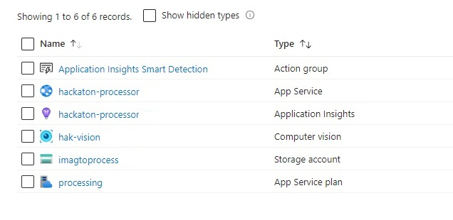

# whistleblower
Software created for AEC Hackathon Wroclaw Edition 2024

[Hackaton Website](https://hack.creoox.com/)

[Hackaton Info on Wroclaw University of Technology Site](https://pwr.edu.pl/uczelnia/przed-nami/aec-hackathon-wroclaw-edition-1927.html)

Phis project is part of a larger solution presented at AEC Hackathon Wroclaw Edition 2024.

In particular it's a response to a specific challange:
> Smart EHS System for Construction Sites – we are looking for innovative solutions to support us in health and safety, ensuring effective prevention and response to potential hazards.

[Atlas Ward Challange Post on Linkedin](https://www.linkedin.com/posts/atlas-ward-polska-sp-z-o-o-_english-version-below-to-ostatnia-szansa-activity-7247169428419690496-GoE-/)

Rest of the solution can be found under those links:

[Source code for UI Part](https://github.com/mmilian/whistleblower)

[Source Code for External Incident Detection Module - TODO](TODO)

# Overall Solution

1. Video Capture software sends captured images continously to the API
2. API stores the image in Azure Blob Storage and generates URL with SAS token (with expiry date)
3. If enables API then sends image to Azure Vision AI solution for automatic captioning (optional)
4. Incident Detection Module continously asks API for new images based on cutoff (file id)
5. ML Model trained to detect incidents is used on the image
6. If incident is detected data is updated through the API with alert (incident code)
7. Alert Panel (UI) continously refreshes that has been marked as "alert" to display incidents on the screen.
8. User can report the alert or mark it as false alarm.

## Tech Stack for this Part

1. C#
2. .NET 8
3. Visual Studio 2022
4. Solution was hosted using Azure Cloud:
    1. App Service for API
    2. Azure Tables for data storage
    3. Azure Blob Storage for files
    4. Azure Static Web Site on Blob Storage for UI (separate repository)

## Video Capture

Capture Image Project uses [opencvsharp](https://github.com/shimat/opencvsharp) to capture image from camera attached to the pc.
It sends frames in hardcoded interval.

## Image Processing Pipeline API

UploadImageForProcessing is a ASP.NET web API exposing functionality to:
1. store and modify image metadata (stored in Azure Tables)
2. upload images to Azure Blob Storage
3. (optionally) send images to processing to Azure Vision AI

# Resources

